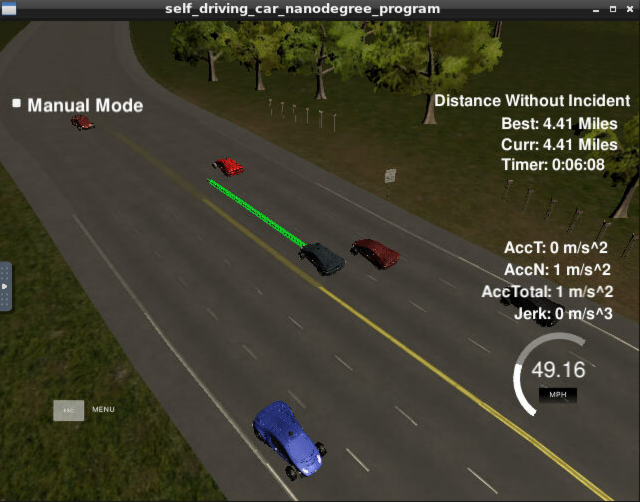

# CarND-Path-Planning-Project
Self-Driving Car Engineer Nanodegree Program

### Project Details
The project is divided into several steps and based on how I approached it. The helper code from the Classroom and the Project Walkthrough presented by David and Aaron were extremely helpful in completing this project. I developed the project as follows -

1. Initially, I started with implementing code (from Classroom) to make the car move forward in a straight line. The next step was to make the car move in it's own lane. In the car's coordinate system incrementing the position by small values while keep the same "d" (calculated based on lane width and distance from waypoints) helped keep the car in the same lane (once in Frenet coordinate system).

2. The next step was to improve/refine the above process. Based on the walkthrough video, several steps were carried out for trajectory generation -

    - Creating a reference point based on the last two points of the prior trajectory.

    - Generating 3 new points evenly spaced, in front of this reference point. This resulted in 4 points spaced at specific intervals (chosen to be 30m).

    - Using the Spline header file, a spline was fit through these points after they were transformed to the car coordinate system.

    - Using this spline, new points were generated/calculated at small intervals along the approximation of the spline. The car would then travel along these points at the desired velocity.

3. The above allowed the car to move well with controlled acceleration and jerk values. Start of the car was further improved/refined so that the car would accelerate properly to the desired maximum velocity. An initial rudimentary logic was implemented so that the car decelerates if there is another car 40m in front of it in the same lane.  

4. A lane-changing algorithm was then implemented based on the sensor fusion data. Thanks to reviewer feedback, this was modified to first calculate which lane the detected car is present in. Based on the detected lane for the vehicle (`vehicle_lane`) and the Ego car lane (`lane`), the algorithm checks how far the vehicle is from the Ego car. If it's 40m ahead and/or 20m behind the Ego car, the variables to check which lane is empty (`right_lane_empty` or `left_lane_empty`) are updated.

5. Once it has calculated that there is a car in front of the Ego vehicle, and which of the adjacent lanes is empty - the Ego vehicle slows down and moves to the empty lane.

### Results

The car was able to drive around the track for more than the required 4.32 miles, without any collisions. Here is a screenshot of one such result.

### Project Issues and Future/Continued Work
The only current problem I have noticed is with the simulator itself. In some cases, multiple cars "gang up" around the Ego car. As a result, the Ego car gets stuck in the pattern of slowing down and then speeding up and doesn't manage to change lanes because of cars around it. This can't really be considered as a path planning problem because some of the simulator cars are not dependent on fixed rules - such as, speeding up in a specific lane, instead of driving slowly. Given the context of the project, I haven't noticed any issues related to my algorithm. I would like to extend this by implementing some more complicated path planning algorithms, however.
